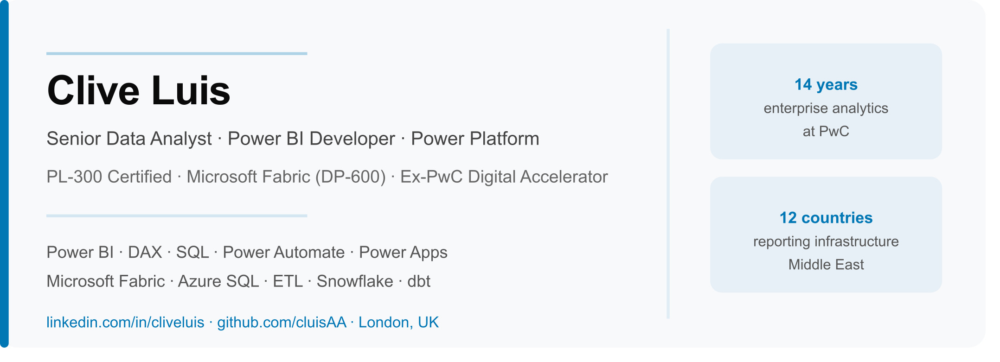

  

<h1 align="center">Clive Luis</h1>

  Senior Data Analyst &nbsp;·&nbsp; Power BI Developer &nbsp;·&nbsp; Power Platform & Automation
   
  London, UK &nbsp;·&nbsp; Ex-PwC Digital Accelerator &nbsp;·&nbsp; PL-300 Certified

  

---

## About me

Data analyst and Power Platform developer with 14 years at PwC in the Middle East, building enterprise reporting and automation solutions across 12 countries.

I turn complex, multi-source data into decisions that stick — and then automate the work so it keeps running without anyone having to ask twice.

Currently based in London and open to Senior Data Analyst and Power BI/Fabric Developer roles (UK-based or remote).

---

## Core stack

**Business Intelligence**
Power BI · DAX · Data Modelling · SQL · ETL · Tableau · Looker Studio

**Power Platform & Automation**
Power Automate · Power Apps · Dataverse · UiPath (RPA)

**Microsoft Fabric & Cloud**
Microsoft Fabric · Data Factory · Lakehouse · PySpark · Azure SQL · Azure Synapse

**Data Engineering**
Snowflake · dbt · BigQuery · Alteryx · Python (pandas, numpy)

---

## Certifications

- Microsoft PL-300 — Power BI Data Analyst (2024)
- CompTIA Data+ (2025)
- dbt Fundamentals (2025)
- Mastering DAX — SQLBI (2023)
- Alteryx Designer Core (2020)
- Currently pursuing: DP-600 Microsoft Fabric Analytics Engineer

---

## Key achievements

- Built a 10-page Power BI executive dashboard used daily by 50+ senior stakeholders, replacing 4–5 days of manual monthly reporting
- Engineered ETL models integrating 7+ systems across 12 countries into a unified data foundation
- Reduced invoice processing time by ~75% using UiPath and Power Automate
- Built Salesforce pipeline forecasting models with ±8% accuracy
- Selected for PwC's Digital Accelerator programme focused on automation, analytics and digital transformation

---

## Currently

- 🎓 MSc Artificial Intelligence — University of Liverpool (part-time, 2026–2028)
- 📖 Pursuing DP-600 Microsoft Fabric Analytics Engineer certification
- 💼 Open to work — Senior Data Analyst / Power BI / Fabric / Power Platform roles in the UK

---

  <a href="https://www.linkedin.com/in/cliveluis/">Connect with me on LinkedIn</a>

